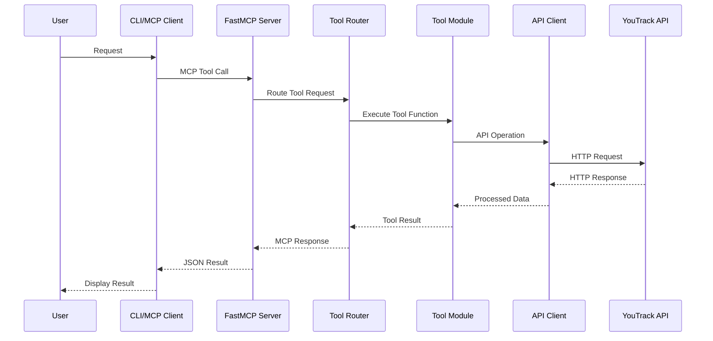
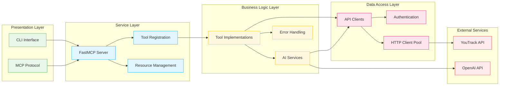
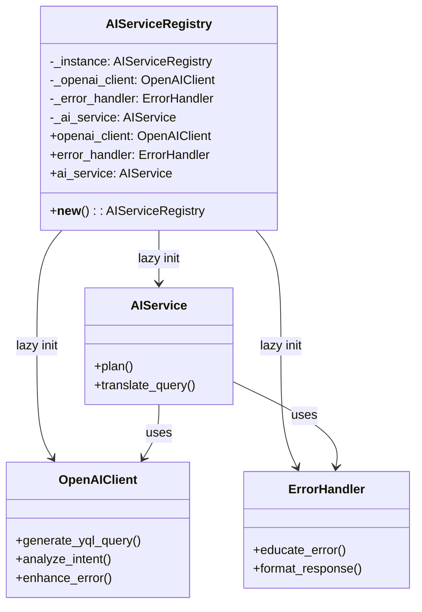
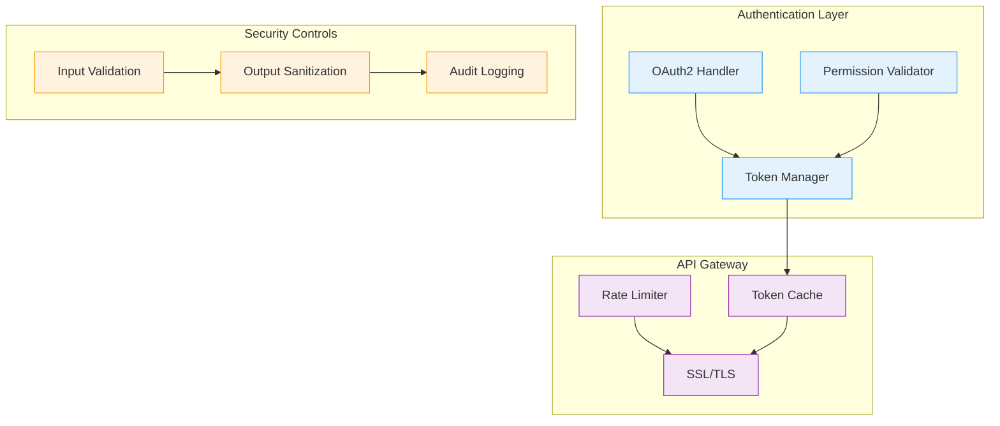
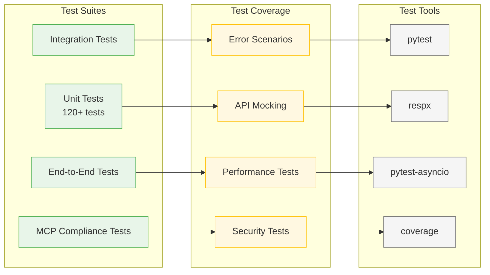

# 🏗️ **YouTrack MCP Architecture - FastMCP Edition**

This document provides a comprehensive overview of the YouTrack MCP server's **modern FastMCP architecture**, featuring complete async support, type safety, and modular design.

## 📊 **Architecture Overview**

```mermaid
graph TB
    %% Entry Point
    subgraph "Entry Point"
        CLI[main.py<br/>stdio mode]
    end
    
    %% Server Layer
    subgraph "Server Layer"
        SERVER[server_fastmcp.py]
        ROUTER[Tool Router]
        RESOURCES[MCP Resources]
    end
    
    %% Tool Layer
    subgraph "Tool Modules"
        subgraph "Core Tools (12)"
            IT[issues_tools.py]
            PT[projects_tools.py]
            ST[search_tools.py]
            UT[users_tools.py]
            AT[ai_tools.py]
            RT[resources_tools.py]
        end
        
        subgraph "Admin Tools"
            PAT[projects_admin_tools.py]
            UAT[users_admin_tools.py]
        end
        
        subgraph "Issues Module (8 components)"
            BASIC[basic_operations.py]
            CUSTOM[custom_fields.py]
            DEDIC[dedicated_updates.py]
            LINK[linking.py]
            DIAG[diagnostics.py]
            ATTACH[attachments.py]
            COMM[comments.py]
            UTIL[utilities.py]
        end
    end
    
    %% API Layer
    subgraph "API Clients"
        CLIENT[YouTrackClient<br/>httpx.AsyncClient]
        IC[IssuesClient]
        PC[ProjectsClient]
        SC[SearchClient]
        UC[UsersClient]
    end
    
    %% AI Layer
    subgraph "AI Services"
        REG[AI Registry<br/>Singleton]
        AISERVICE[AI Service]
        OPENAI[OpenAI Client]
        ERR[Error Handler]
        TMPL[Template Manager]
    end
    
    %% Utility Layer
    subgraph "Utilities"
        CONFIG[Config Manager]
        AUTH[Authentication]
        UTILS[Date/Field Utils]
        LOADER[Tool Loader]
        EDUCATOR[Error Educator]
    end
    
    %% External Services
    subgraph "External"
        YT[(YouTrack API)]
        OAIAPI[(OpenAI API)]
    end
    
    %% Connections
    CLI --> SERVER
    SERVER --> ROUTER
    SERVER --> RESOURCES
    
    ROUTER --> IT
    ROUTER --> PT
    ROUTER --> ST
    ROUTER --> UT
    ROUTER --> AT
    ROUTER --> RT
    ROUTER --> PAT
    ROUTER --> UAT
    
    IT --> BASIC
    IT --> CUSTOM
    IT --> DEDIC
    IT --> LINK
    IT --> DIAG
    IT --> ATTACH
    IT --> COMM
    IT --> UTIL
    
    IT --> IC
    PT --> PC
    ST --> SC
    UT --> UC
    AT --> AISERVICE
    
    IC --> CLIENT
    PC --> CLIENT
    SC --> CLIENT
    UC --> CLIENT
    
    CLIENT --> YT
    
    AISERVICE --> REG
    REG --> OPENAI
    REG --> ERR
    AISERVICE --> TMPL
    
    OPENAI --> OAIAPI
    
    SERVER --> CONFIG
    CLIENT --> AUTH
    IC --> UTILS
    SERVER --> LOADER
    IC --> EDUCATOR
    
    classDef entry fill:#e1f5e1,stroke:#4caf50,stroke-width:2px
    classDef server fill:#e3f2fd,stroke:#2196f3,stroke-width:2px
    classDef tool fill:#fff3e0,stroke:#ff9800,stroke-width:2px
    classDef api fill:#fce4ec,stroke:#e91e63,stroke-width:2px
    classDef ai fill:#f3e5f5,stroke:#9c27b0,stroke-width:2px
    classDef util fill:#f5f5f5,stroke:#757575,stroke-width:2px
    classDef external fill:#ffebee,stroke:#f44336,stroke-width:2px
    
    class CLI entry
    class SERVER,ROUTER,RESOURCES server
    class IT,PT,ST,UT,AT,RT,PAT,UAT,BASIC,CUSTOM,DEDIC,LINK,DIAG,ATTACH,COMM,UTIL tool
    class CLIENT,IC,PC,SC,UC api
    class REG,AISERVICE,OPENAI,ERR,TMPL ai
    class CONFIG,AUTH,UTILS,LOADER,EDUCATOR util
    class YT,OAIAPI external
```



## 🏗️ **Modular Design**

The YouTrack MCP server features a modern, modular architecture that enhances maintainability, testability, and code organization. The core `issues` module has been refactored from a monolithic 1,797-line file into 8 focused modules:

```
youtrack_mcp/tools/issues/
├── __init__.py                 # Package initialization and unified interface
├── basic_operations.py         # Core CRUD operations (get, create, update, search)
├── custom_fields.py            # Custom field management and validation
├── dedicated_updates.py        # Specialized update functions (state, priority, assignee)
├── linking.py                  # Issue relationships and dependencies
├── diagnostics.py              # Workflow analysis and help systems
├── attachments.py              # File and raw data operations
├── comments.py                 # Comment retrieval and management
└── utilities.py                # Infrastructure and tool definitions
```

## **FastMCP Architecture Benefits**

### **Core Framework Advantages**
- **⚡ Performance**: Full async/await support with httpx.AsyncClient for optimal HTTP performance
- **🔒 Type Safety**: Complete type hint coverage with Pydantic models and validation
- **📦 Schema Auto-generation**: JSON schemas automatically generated from Python type hints
- **🔄 MCP Compliance**: Full Model Context Protocol compliance with Claude Code CLI auto-resume
- **🛠️ Modern SDK**: Latest MCP SDK with enhanced error handling and tool registration

### **Modular Design Benefits**
- **🔧 Maintainability**: Each module has a single responsibility, making code easier to understand and modify
- **🧪 Testability**: Focused modules enable comprehensive unit testing (120+ tests across all modules)
- **📈 Scalability**: Clear separation of concerns allows for independent module development
- **🔄 Backward Compatibility**: Existing API interfaces remain unchanged
- **📚 Documentation**: Improved code organization with comprehensive docstrings

## Module Responsibilities

| Module | Functions | Purpose |
|--------|-----------|---------|
| `basic_operations` | 5 functions | Core CRUD operations for issues |
| `custom_fields` | 5 functions | Custom field management and validation |
| `dedicated_updates` | 5 functions | Specialized field updates with enhanced error handling |
| `linking` | 7 functions | Issue relationships and dependency management |
| `diagnostics` | 2 functions | Workflow analysis and interactive help |
| `attachments` | 2 functions | File operations and raw data access |
| `comments` | 6 functions | Comment retrieval and management |
| `utilities` | 2 functions | Infrastructure and tool consolidation |

## Testing Coverage

The modular architecture enables comprehensive testing:
- **120+ unit tests** across all 8 modules with extensive coverage
- **Test categories**: Success scenarios, error handling, validation, integration, async functionality
- **Coverage areas**: API error handling, workflow restrictions, parameter validation, MCP compliance
- **Test organization**: One test file per module for focused testing
- **Integration tests**: End-to-end testing with mock YouTrack API
- **MCP compliance**: Official SDK contract tests for Claude Code CLI compatibility

## Integration

The modular components are integrated through a unified `IssueTools` class that:
- Maintains backward compatibility with existing code
- Provides a clean delegation interface
- Consolidates tool definitions from all modules
- Enables seamless upgrades and maintenance

## 🔗 **Component Relationships**

### **Data Flow**



### **Layer Dependencies**



## **FastMCP Codebase Organization**

The codebase is organized into logical modules with modern FastMCP architecture:

```
youtrack_mcp/
├── server_fastmcp.py      # 🚀 FastMCP server with typed tool registration
├── api/                   # YouTrack API client implementations
│   ├── client.py          # Base HTTP client with httpx.AsyncClient
│   ├── issues.py          # Issue operations (CRUD, search, linking)
│   ├── projects.py        # Project management operations
│   ├── search.py          # Search and query operations
│   └── users.py           # User management operations
├── tools/                 # MCP tool implementations
│   ├── issues/            # 🧩 Modular issue management (8 focused modules)
│   │   ├── __init__.py                 # Package initialization
│   │   ├── basic_operations.py         # Core CRUD operations
│   │   ├── custom_fields.py            # Custom field management
│   │   ├── dedicated_updates.py        # Specialized updates
│   │   ├── linking.py                  # Issue relationships
│   │   ├── diagnostics.py              # Workflow analysis
│   │   ├── attachments.py              # File operations
│   │   ├── comments.py                 # Comment management
│   │   └── utilities.py                # Infrastructure tools
│   ├── issues_tools.py    # Core issue operations
│   ├── projects_tools.py  # Project management
│   ├── search_tools.py    # Search functionality
│   ├── users_tools.py     # User management
│   ├── ai_tools.py        # AI planning tools
│   ├── resources_tools.py # MCP resource management
│   ├── projects_admin_tools.py  # Project administration
│   └── users_admin_tools.py     # User administration
├── config.py              # Configuration management
├── utils/                 # Utility modules
│   ├── __init__.py
│   ├── datetime.py        # Date/time utilities
│   ├── error_educator.py  # Error handling education
│   ├── help_resources.py  # Help system resources
│   ├── loader.py          # 🛠️ Modern tool loading system
│   └── utils.py           # General utilities
└── mcp_resources.py       # MCP resource handlers
```

### **Key FastMCP Components**

- **`server_fastmcp.py`**: Modern FastMCP server with `@mcp.tool()` decorators and typed signatures
- **`utils/loader.py`**: Modern tool loading system for dynamic tool registration
- **`mcp_resources.py`**: MCP resource handlers for documentation and help systems
- **Modular Tools**: 8 focused modules in `tools/issues/` for maintainable code organization

## 🔧 **Key Architectural Patterns**

### **1. Singleton Pattern for AI Services**



### **2. Async/Await Pattern**

All API operations use async/await for optimal performance:

```python
# httpx.AsyncClient for HTTP operations
async def get_issue(issue_id: str) -> dict:
    async with httpx.AsyncClient() as client:
        response = await client.get(url)
        return response.json()
```

### **3. Tool Registration Pattern**

FastMCP tools are registered with typed signatures:

```python
@mcp.tool()
async def issues_get(
    issue_id: str,
    include: Optional[List[str]] = None
) -> dict:
    """Get issue with optional expansions."""
    # Tool implementation
```

### **4. Modular Delegation Pattern**

The main IssueTools class delegates to specialized modules:

```python
class IssueTools:
    def __init__(self, client):
        self.basic = BasicOperations(client)
        self.custom = CustomFields(client)
        self.updates = DedicatedUpdates(client)
        # ... other modules
    
    async def get(self, issue_id):
        return await self.basic.get_issue(issue_id)
```

## 📈 **Performance Optimizations**

### **Connection Pooling**
- Single httpx.AsyncClient instance shared across requests
- Connection reuse for multiple API calls
- Configurable pool size and timeout settings

### **Lazy Loading**
- AI services initialized only when first accessed
- Configuration loaded on demand
- Token authentication cached and refreshed as needed

### **Error Recovery**
- Exponential backoff for rate limiting
- Automatic retry for transient failures
- Graceful degradation for non-critical features

## 🔐 **Security Architecture**



## 🧪 **Testing Architecture**



## Development Resources

For more information about the architecture and development:

- **[Refactoring Tracker](REFACTORING_TRACKER.md)**: Complete details of the modular architecture refactoring
- **[Testing Guide](tests/README.md)**: Comprehensive testing documentation
- **[Automation Scripts](automations/README.md)**: Build, test, and deployment automation
- **[Configuration Guide](configuration.md)**: Setup and configuration instructions
- **[Security Best Practices](security.md)**: Security implementation details

---

*This architecture provides a solid foundation for maintainable, testable, and scalable MCP server development with YouTrack integration.*